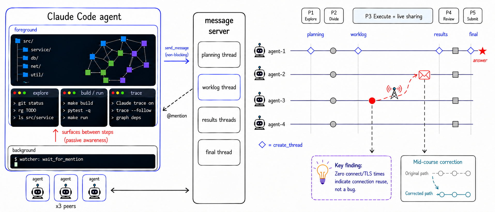

<p align="center">
  
</p>

<h1 align="center">📻 AgentRadio</h1>

<h3 align="center">장기 과제 멀티에이전트 협업을 위한 수동적 인지 — 네 개의 코딩 에이전트가 <b>일하면서</b> 듣는다</h3>

<p align="center">
  <a href="https://arxiv.org/abs/2607.28430"></a>
  <a href="https://github.com/Coral-Protocol/AgentRadio"></a>
  <a href="LICENSE"></a>
</p>

<p align="center">
  <a href="https://github.com/scaleapi/SWE-Atlas"></a>
  <a href="https://github.com/laude-institute/harbor"></a>
  <a href="https://modal.com"></a>
</p>

<p align="center">
  <a href="https://discord.gg/GSHKNXF8U"></a>
  <a href="https://github.com/Coral-Protocol"></a>
</p>

<p align="center">
  <a href="README.md">English</a> |
  <a href="README.zh-CN.md">简体中文</a> |
  <a href="README.es.md">Español</a> |
  <a href="README.ja.md">日本語</a> |
  <b>한국어</b> |
  <a href="README.ar.md">العربية</a>
</p>

<p align="center">
  <i>네 개의 코딩 에이전트에게 공유 무전 채널을 주세요. 이들은 일을 나누고 계획을 협상하며,
  <b>작업하는 동안</b> 계속 발견을 방송합니다 — 듣기가 백그라운드 작업으로 돌아가기에 한 턴을
  빼앗지 않기 때문입니다.</i>
</p>

이 저장소는 논문 *AgentRadio: Passive Awareness for Long-Horizon Multi-Agent Collaboration*
([arXiv:2607.28430](https://arxiv.org/abs/2607.28430))의 실험을 재현하기 위한 코드와 데이터를
담고 있습니다.

### 🏆 하나의 프로토콜, 네 개의 에이전트 — 단일 에이전트 대비 +29.8 포인트

| 구성 | 추가되는 요소 | 과제 정확도 (Opus 4.6) | 과제 정확도 (DeepSeek V4 Pro) |
|---|---|:---:|:---:|
| **B0** 단일 에이전트 | — | 32.3 % | 29.0 % |
| **B1** 단독 실행 6회 중 최고 | 6배 예산, 협업 없음 | 37.9 % | 31.4 % |
| **L1** 네 에이전트 + 분업 | 분업 | 39.5 % | 31.4 % |
| **L2** + 협상 | 공동 계획 + 교차 검토 (블로킹 수신) | 51.6 % | 39.5 % |
| **L3** + 수동적 인지 (**AgentRadio**) | 백그라운드 `wait_for_mention` | **62.1 %** | **50.8 %** |

L2에서 L3로 가는 단계에서 바뀌는 것은 **오직** 통신 방식뿐입니다. Opus 4.6에서 15개 과제를 이기고
2개를 지며(정확 McNemar 검정, p = 0.0023), DeepSeek에서는 17승 3패입니다(p = 0.0026).
AgentRadio 하의 Opus 4.6 에이전트 넷(62.1 %)은 가장 강력한 단일 에이전트 리더보드 기록인
최신 Opus 4.8 기반 Claude Code(57.2 %)를 넘어섭니다.

→ [전체 결과 보기](#-결과) · [논문](https://arxiv.org/abs/2607.28430) · [직접 실행해 보기](#-네-가지-구성-실행하기)

## 📣 소식

- **2026-08** — AgentRadio가 [VentureBeat](https://venturebeat.com/)에 소개되었습니다: [「실시간으로 협업하는 네 개의 AI 에이전트가 기업용 코딩 과제에서 Claude Opus 4.8을 앞섰다」](https://venturebeat.com/orchestration/four-ai-agents-coordinating-in-real-time-outperformed-claude-opus-4-8-on-enterprise-coding-tasks). 📰
- **2026-07** — AgentRadio 논문이 [arXiv](https://arxiv.org/abs/2607.28430)에 공개되었습니다. 🎉
- **2026-07** — 코드, 어댑터, 124개 SWE-Atlas QnA 과제 전체 설정이 오픈소스로 공개되었습니다. 🚀

## 💡 왜 AgentRadio인가

* **통신이 더 이상 작업을 소모하지 않음** — `wait_for_mention`이 하네스의 *백그라운드 작업*으로
  실행되어, 동료의 메시지가 턴을 소비하지 않고 다음 스텝 경계에서 드러납니다. 에이전트는 이제
  일할지 들을지를 고르지 않아도 됩니다.
* **실행 도중의 궤도 수정** — 블로킹 방식에서는 하나의 발견이 다음 단계 경계까지 동료에게
  전달되지 못합니다. 수동적 인지에서는 즉시 도달하고, 동료는 이미 진행 중인 과제에 그것을
  녹여 넣습니다.
* **하네스 수정 불필요** — 하네스는 셸 명령을 백그라운드로 실행할 수만 있으면 되며, 주요 코딩
  하네스는 이미 이를 지원합니다. AgentRadio는 독립 메시지 서버와 세 개의 얇은 셸 스크립트로
  제공됩니다.
* **추가 LLM 호출 없음** — 워처는 에이전트의 한 스텝이 아니라 평범한 운영체제 프로세스입니다.
  에이전트가 새로 지불하는 토큰은 실제로 드러난 메시지뿐입니다.
* **모델 비종속** — 동일한 프로토콜, 프롬프트, 시작 스크립트가 Claude Opus 4.6에서도, LiteLLM
  변환 프록시를 통한 DeepSeek-V4-Pro에서도 동작합니다.
* **깔끔한 절제(ablation) 사다리** — B0 → L1 → L2 → L3가 동일한 하네스 설정에서 분업, 협상,
  수동적 인지의 기여를 한 겹씩 분리해 냅니다.

## 🧩 작동 방식

### 세 가지 프리미티브

AgentRadio는 모든 에이전트에게 세 가지 연산을 제공합니다.

| 프리미티브 | 동작 |
|---|---|
| `create_thread(name, participants)` | 메시지 서버에 이름 있는 대화 스레드를 열고 그 식별자를 반환합니다. |
| `send_message(thread, content, mentions)` | 스레드에 메시지를 추가하고, 듣는 사람이 있든 없든 즉시 반환합니다. 특정 에이전트를 @ 멘션할 수 있습니다. |
| `wait_for_mention(timeout)` | 호출자를 멘션하는 메시지가 도착할 때까지 블로킹한 뒤, 모든 스레드의 전체 스냅숏과 함께 반환합니다. 따라서 맥락을 재구성하기 위해 두 번 읽을 필요가 없습니다. |

이 계층은 에이전트가 *언제* 들어야 하는지에 대해 아무 입장도 취하지 않습니다. `wait_for_mention`이
어디서 실행되는지가 두 통신 방식을 가르는 유일한 자유도입니다.

- **포그라운드** → *블로킹 수신*. 에이전트는 듣기 위해 작업을 멈춥니다. 메시지 하나를 들을 때마다
  작업 스텝 하나의 비용이 듭니다. 이것이 L2 기준선입니다.
- **백그라운드 작업** → *수동적 인지*. 에이전트는 계속 일하고, 모든 멘션은 다음 스텝 경계에서
  드러나며 듣기에 쓰이는 스텝은 없습니다. 이것이 L3, 완전한 AgentRadio입니다.

그 외 모든 것 — 프리미티브, 스레드, 프로토콜 — 은 고정입니다. 실험이 분리해 내는 것은 바로 이
1비트의 차이입니다.

### 5단계 프로토콜

네 개의 에이전트가 분업과 협상으로 이루어진 고정 프로토콜을 수행합니다. agent-1은 추가로
**조립자(assembler)** 역할을 맡아 계획 스레드, 작업 로그 스레드, 최종 답변 스레드를 열고 모든
전환을 통제합니다. 한 단계는 모든 에이전트로부터 명시적 승인을 모은 뒤에야 끝납니다.

1. **P1 · 탐색** — 각 에이전트가 백그라운드 워처를 시작하고, 독립적으로 저장소를 탐색하며,
   자신이 본 하위 질문들을 작성합니다. 이 단계에서는 아무것도 전송하지 않습니다.
2. **P2 · 분업** — 조립자가 계획 스레드를 엽니다. 에이전트들은 각자의 발견을 모으고, 하위 질문의
   분할안을 협상하며, 모든 에이전트가 승인할 때까지 수정합니다.
3. **P3 · 실행** — 각 에이전트가 자기 하위 질문을 처리합니다. 발견이 생긴 순간 작업 로그에
   게시합니다 — 동료와 관련된 발견, 합의된 계획과의 모순, 장애물, 포기한 막다른 길.
4. **P4 · 검토** — 각 에이전트가 자신의 결과 스레드에 발견과 근거를 방송합니다. 검토자는 사실
   충돌, 근거 부족, 언급되지 않은 관찰을 게시하고, 하위 질문을 P3로 되돌릴 수 있습니다.
5. **P5 · 제출** — 조립자가 승인된 결과들로 최종 답변을 작성하고, 마지막 승인 라운드를 위해 초안을
   방송한 뒤 제출합니다.

블로킹 수신에서도 같은 다섯 단계가 그대로 실행되지만 P3의 실시간 공유가 사라집니다. 메시지를
들으려면 포그라운드 대기 비용을 치러야 하므로, 에이전트들은 일하는 동안 침묵하고 하나의 발견은
P4 이전에 동료에게 닿을 수 없습니다.

## 🗂️ 저장소 구조

```
data/qa/                          124 SWE-Atlas QnA tasks (harbor dataset scale-ai/swe-atlas-qna)
multi_agent/
  coral_multi_agent.py            L2 adapter: division + negotiation (blocking receive)
  coral_multi_agent_ablation.py   L1 adapter: division only
  coral_multi_agent_passive.py    L3 adapter: full AgentRadio (passive awareness)
  startup.sh / startup_ablation.sh / startup_passive.sh
                                  per-agent bootstrap + protocol prompts (CLAUDE.md)
  coral-agent*.toml               message-server agent definitions
  passive_scripts/                MCP-over-HTTP shell primitives (create_thread /
                                  send_message / wait_for_mention / read_resource)
  coral-server.jar                message server (download from Releases, see below)
  monitor_coral_log.sh            live thread/message monitor for running containers
run_config/qa/
  claude-token                    OAuth token helper
  full_run.sh                     B0 baseline batch runner (all 124 tasks)
  run_passive_multi_agent.sh      L3 batch runner
verify_local.py                   rubric verifier (LLM judge), run locally on a trial dir
```

`data/qa/` 아래의 각 과제 디렉터리에는 지시문, 고정된 실행 환경, 그리고 검증기가 사용하는 루브릭
세트가 들어 있습니다.

---

## 📦 설치

실행은 [Modal](https://modal.com) 위의 Docker 컨테이너에서 이루어지며,
[Harbor](https://github.com/laude-institute/harbor)가 오케스트레이션합니다.
하나의 과제 = 메시지 서버와 네 개의 Claude Code 에이전트가 도는 하나의 컨테이너입니다.

### 1. Docker Desktop

https://www.docker.com/products/docker-desktop/ 에서 설치하고 `docker run hello-world`로 확인하세요.

### 2. uv

```bash
curl -LsSf https://astral.sh/uv/install.sh | sh
```

### 3. Harbor (0.6.4로 고정)

최신 Harbor 릴리스(0.7+)에는 호환성을 깨는 API 변경이 있어 이 어댑터들이 실패합니다. 버전을
고정하세요.

| 구성 요소 | 동작 버전 |
|-----------|-----------------|
| harbor | **0.6.4** |
| modal | **1.4.2** |

```bash
uv tool uninstall harbor 2>/dev/null || true
uv tool install 'harbor[modal]==0.6.4'
harbor --version   # must show 0.6.4
```

### 4. Modal

```bash
pip install 'modal==1.4.2'
modal --version    # must show 1.4.2
modal setup        # opens browser to log in
```

### 5. Claude Code

```bash
curl -fsSL https://claude.ai/install.sh | sh
claude --version
```

에이전트에는 **Claude Max 구독**이 필요합니다. 검증기에는 추가로 **Anthropic API 키**가 필요합니다.

### 6. 메시지 서버 JAR

106 MB 크기의 서버 JAR는 익명화된 아티팩트로 호스팅됩니다(git blob으로 두기에는 너무 큽니다).
`confirm=t` 파라미터는 대용량 파일 검사 중간 페이지를 우회해 `curl`이 바이너리를 바로 받도록 합니다.

```bash
curl -L -o multi_agent/coral-server.jar \
  "https://drive.usercontent.google.com/download?id=17b40_1kXFrAC0pnN8w_7PPY13O7pYVke&export=download&confirm=t"
```

어댑터가 이 JAR를 각 과제 컨테이너에 업로드합니다. 로컬에서 실행할 것이 없으므로 로컬 JDK도
필요하지 않습니다.

### 7. 토큰 헬퍼와 .env

```bash
cp run_config/qa/claude-token ~/.local/bin/claude-token
chmod +x ~/.local/bin/claude-token
cp .env.example .env      # then fill in your Anthropic API key
```

### 매 실행 전: OAuth 토큰 갱신

Claude Code의 OAuth 토큰은 주기적으로 교체됩니다. 각 컨테이너는 시작 시 정적 스냅숏만 받으므로,
만료된 토큰은 실행 도중 네 에이전트를 모두 401로 종료시킵니다. 세션마다 갱신하세요.

```bash
claude /login    # opens browser

security find-generic-password -s "Claude Code-credentials" -w | python3 -c "
import json, sys, os
data = json.loads(sys.stdin.read())
oauth = data.get('claudeAiOauth', {})
with open(os.path.expanduser('~/.claude/.credentials.json'), 'w') as f:
    json.dump({'claudeAiOauth': oauth}, f, indent=2)
print(f'Token refreshed. Expires at: {oauth.get(\"expiresAt\")}')
"

~/.local/bin/claude-token --check
source .env
```

---

## ⚡ 네 가지 구성 실행하기

모든 명령은 저장소 루트에서 `source .env` 이후에 실행합니다. 과제 ID는 `data/qa/` 아래의 디렉터리
이름입니다(`-i`를 반복하면 배치 지정, `-i`를 완전히 빼면 124개 전부 실행). `-n`은 동시 실행 과제
수입니다(L1–L3에서는 한 과제 = 네 에이전트).

### B0 — 단일 에이전트 (기준선)

```bash
source .env

harbor run \
  -p ./data/qa \
  -a claude-code \
  -m "anthropic/claude-opus-4-6" \
  -e modal -k 1 -n 1 \
  -i "task-6905333b74f22949d97ba998" \
  --ak reasoning_effort=high \
  -o results/qa/ \
  --job-name "baseline-ba998" \
  -y
```

### L1 — 네 에이전트 + 분업

agent-1이 짧게 탐색한 뒤 질문을 나누고, 각 에이전트가 자기 몫을 독립적으로 해결합니다. 답변은
검토 없이 병합됩니다.

```bash
source .env
export PYTHONPATH="$(pwd):${PYTHONPATH:-}"

harbor run \
  -p ./data/qa \
  --agent-import-path='multi_agent.coral_multi_agent_ablation:CoralMultiAgentAblation' \
  -m "anthropic/claude-opus-4-6" \
  -e modal -k 1 -n 1 \
  -i "task-6905333b74f22949d97ba998" \
  --ak reasoning_effort=high \
  -o results/qa/ \
  --job-name "division-ba998" \
  -y
```

### L2 — + 협상 (블로킹 수신)

완전한 5단계 프로토콜 — 공동 탐색, 만장일치까지의 분할 협상, 실행, 교차 검토, 조립 제출 — 이지만
`wait_for_mention`이 **포그라운드**에서 실행되어 에이전트가 듣기 위해 작업을 멈춥니다.

```bash
source .env
export PYTHONPATH="$(pwd):${PYTHONPATH:-}"

harbor run \
  -p ./data/qa \
  --agent-import-path='multi_agent.coral_multi_agent:CoralMultiAgent' \
  -m "anthropic/claude-opus-4-6" \
  -e modal -k 1 -n 1 \
  -i "task-6905333b74f22949d97ba998" \
  --ak reasoning_effort=high \
  -o results/qa/ \
  --job-name "divneg-ba998" \
  -y
```

### L3 — + 수동적 인지 (완전한 AgentRadio)

프로토콜은 동일하지만 `wait_for_mention`이 **백그라운드 작업**으로 실행됩니다. 에이전트는 계속
일하고 메시지는 스텝 사이에 드러납니다. Claude Code에는 MCP 설정이 주어지지 않으며, 모든 통신은
`passive_scripts/`의 얇은 셸 래퍼를 통해 이루어집니다.

```bash
source .env
export PYTHONPATH="$(pwd):${PYTHONPATH:-}"

harbor run \
  -p ./data/qa \
  --agent-import-path='multi_agent.coral_multi_agent_passive:CoralMultiAgentPassive' \
  -m "anthropic/claude-opus-4-6" \
  -e modal -k 1 -n 1 \
  -i "task-6905333b74f22949d97ba998" \
  --ak reasoning_effort=high \
  -o results/qa/ \
  --job-name "passive-ba998" \
  -y
```

`run_config/qa/run_passive_multi_agent.sh`는 같은 명령을 배치 러너로 감싸, 과제 ID마다 harbor
job을 하나씩 실행합니다.

---

## 🔀 DeepSeek-V4-Pro로 실행하기

멀티에이전트 구성(L1–L3)은 Opus 4.6 대신 **DeepSeek-V4-Pro** 에이전트로 실행하여 결과표의
DeepSeek 열을 재현할 수 있습니다. 프로토콜, 프롬프트, 시작 스크립트, 재개 가드는 모두 동일하며
LLM 백엔드만 바뀝니다.

Claude Code는 Anthropic Messages API만 사용하는 반면 DeepSeek은 OpenRouter(OpenAI 호환 전용)를
통해 제공됩니다. 둘 사이를 **Modal에 한 번만 호스팅하는 LiteLLM 변환 프록시**로 연결합니다. 과제
컨테이너는 아무것도 설치하지 않고 `ANTHROPIC_BASE_URL`을 프록시의 공개 URL로 가리키기만 합니다.

루브릭 검증기는 그대로입니다. 여전히 사용자의 Anthropic 심판 모델(`OPENAI_API_KEY` /
`EVAL_MODEL`)을 사용합니다. DeepSeek은 *에이전트* 백엔드일 뿐입니다.

### 최초 1회 프록시 설정

```bash
# 1. An OpenRouter API key with deepseek-v4-pro access (https://openrouter.ai/keys)
#    is stored as a Modal secret — it never leaves your Modal account.
modal secret create openrouter-deepseek OPENROUTER_API_KEY=sk-or-...

# 2. Deploy the proxy. This prints your personal URL.
modal deploy multi_agent/deepseek_litellm_modal.py
# -> https://<your-user>--deepseek-litellm-proxy-serve.modal.run

# 3. Put that URL in .env so the adapters can find it:
echo 'export AGENTRADIO_PROXY_URL=https://<your-user>--deepseek-litellm-proxy-serve.modal.run' >> .env
source .env
```

프록시는 웜 상태를 유지합니다(`min_containers=1`). 수정한 뒤에만 재배포하면 됩니다. 유휴 상태에서
과금을 멈추려면 `modal app stop deepseek-litellm-proxy` (나중에 `modal deploy`로 복구됩니다).

### DeepSeek으로 L1 / L2 / L3 실행

위의 Opus 명령과 동일하되, import 경로가 DeepSeek 어댑터를 가리키고 `-m "deepseek-v4-pro"`가
프록시를 경유합니다. `source .env`로 `AGENTRADIO_PROXY_URL`이 export되어 있어야 합니다. 과제 ID와
`-i` 배치 방식은 위와 완전히 같습니다.

#### DeepSeek B0 — 단일 에이전트 (기준선)

DeepSeek 기준선은 내장 `claude-code` 에이전트의 얇은 서브클래스를 사용합니다(프록시 엔드포인트를
강제하고, 내장 에이전트가 다시 발급하려는 OAuth 토큰을 버립니다). 그래서 `-a claude-code`가 아니라
`--agent-import-path`를 받습니다.

```bash
source .env
export PYTHONPATH="$(pwd):${PYTHONPATH:-}"

harbor run \
  -p ./data/qa \
  --agent-import-path='multi_agent.claude_code_deepseek:ClaudeCodeDeepseek' \
  -m "deepseek-v4-pro" \
  -e modal -k 1 -n 1 \
  -i "task-6905333b74f22949d97ba998" \
  --ak reasoning_effort=high \
  -o results/qa/ \
  --job-name "deepseek-baseline-ba998" \
  -y
```

#### DeepSeek L1 — 분업만

```bash
source .env
export PYTHONPATH="$(pwd):${PYTHONPATH:-}"

harbor run \
  -p ./data/qa \
  --agent-import-path='multi_agent.coral_multi_agent_ablation_deepseek:CoralMultiAgentAblationDeepseek' \
  -m "deepseek-v4-pro" \
  -e modal -k 1 -n 1 \
  -i "task-6905333b74f22949d97ba998" \
  --ak reasoning_effort=high \
  -o results/qa/ \
  --job-name "deepseek-division-ba998" \
  -y
```

#### DeepSeek L2 — + 협상

```bash
source .env
export PYTHONPATH="$(pwd):${PYTHONPATH:-}"

harbor run \
  -p ./data/qa \
  --agent-import-path='multi_agent.coral_multi_agent_deepseek:CoralMultiAgentDeepseek' \
  -m "deepseek-v4-pro" \
  -e modal -k 1 -n 1 \
  -i "task-6905333b74f22949d97ba998" \
  --ak reasoning_effort=high \
  -o results/qa/ \
  --job-name "deepseek-divneg-ba998" \
  -y
```

#### DeepSeek L3 — + 수동적 인지

```bash
source .env
export PYTHONPATH="$(pwd):${PYTHONPATH:-}"

harbor run \
  -p ./data/qa \
  --agent-import-path='multi_agent.coral_multi_agent_passive_deepseek:CoralMultiAgentPassiveDeepseek' \
  -m "deepseek-v4-pro" \
  -e modal -k 1 -n 1 \
  -i "task-6905333b74f22949d97ba998" \
  --ak reasoning_effort=high \
  -o results/qa/ \
  --job-name "deepseek-passive-ba998" \
  -y
```

모든 멀티에이전트 로직, 시작 스크립트, 재개 가드를 상속하면서 LLM 백엔드만 교체하는 공유 프록시
주입 로직은 `multi_agent/deepseek_proxy.py`에 있습니다. B0 기준선 서브클래스는
`multi_agent/claude_code_deepseek.py`입니다.

### 취소되거나 실패한 job 재개

```bash
source .env
export PYTHONPATH="$(pwd):${PYTHONPATH:-}"
harbor job resume -p results/qa/<job-name> -f CancelledError -f RuntimeError
```

### 실시간 모니터링 (선택, 별도 터미널)

```bash
bash multi_agent/monitor_coral_log.sh   # renders coral://state from the running container
```

---

## 🧪 채점

각 시행은 팀의 답변을 `<trial>/agent/answer.txt`에 기록합니다. 벤치마크의 LLM 심판으로 채점하세요.

```bash
source .env
python3 verify_local.py <task-id> <trial-dir>
# e.g.
python3 verify_local.py task-6905333b74f22949d97ba998 \
  results/qa/divneg-ba998/task-6905333b74f22949d97ba998__XXXXX
```

이 명령은 `<trial>/verifier/reward.txt`(모든 루브릭을 통과했을 때만 1)와
`evaluation_results.json`(루브릭별 점수)을 기록합니다. 없다면 `pip install openai`를 실행하세요.

### 시행 출력 구조

```
task-xxx__randomId/
├── config.json / result.json / trial.log
├── agent/
│   ├── answer.txt                # final answer (written by agent-1)
│   ├── coral-server.log          # threads and messages
│   └── agent-{1..4}-claude-code.txt
└── verifier/
    ├── reward.txt
    └── evaluation_results.json
```

---

## 📊 결과

SWE-Atlas QnA 전체 결과(124개 과제, 1,306개 루브릭). 카테고리 행은 해결한 과제 수이며, 괄호 안은
해당 카테고리의 과제 총수입니다. 각 모델 열 안에서 모든 구성은 동일한 하네스와 설정을 사용합니다.

`B0` = 단일 Claude Code · `L1` = 4× Claude Code + 분업 · `L2` = L1 + 협상 ·
`L3` = L2 + 수동적 인지(AgentRadio).

**Opus 4.6**

| | B0 | L1 | L2 | L3 |
|---|:---:|:---:|:---:|:---:|
| 아키텍처 및 시스템 설계 (44) | 15 | 13 | 24 | **30** |
| 근본 원인 분석 (37) | 9 | 16 | 18 | **20** |
| 코드 온보딩 (28) | 11 | 12 | 14 | **18** |
| 보안 (11) | 4 | **7** | **7** | **7** |
| API 및 라이브러리 통합 (4) | 1 | 1 | 1 | **2** |
| **해결한 과제 수 (124)** | 40 | 49 | 64 | **77** |
| **과제 정확도 (%)** | 32.3 | 39.5 | 51.6 | **62.1** |
| **루브릭 통과율 (%)** | 84.2 | 86.1 | 91.3 | **93.1** |

**DeepSeek V4 Pro**

| | B0 | L1 | L2 | L3 |
|---|:---:|:---:|:---:|:---:|
| 아키텍처 및 시스템 설계 (44) | 14 | 13 | 17 | **24** |
| 근본 원인 분석 (37) | 11 | 13 | 15 | **18** |
| 코드 온보딩 (28) | 7 | 8 | 10 | **13** |
| 보안 (11) | 4 | 4 | 6 | **7** |
| API 및 라이브러리 통합 (4) | 0 | 0 | 1 | **1** |
| **해결한 과제 수 (124)** | 36 | 39 | 49 | **63** |
| **과제 정확도 (%)** | 29.0 | 31.4 | 39.5 | **50.8** |
| **루브릭 통과율 (%)** | 81.2 | 83.7 | 85.9 | **90.2** |

**L3 대 L2, 쌍을 이룬 과제 결과에 대한 정확 McNemar 검정** — Opus 4.6: 15승 2패, p = 0.0023.
DeepSeek V4 Pro: 17승 3패, p = 0.0026.

루브릭 수준 분석에 따르면 수동적 인지로 인한 이득은 과제 난이도가 높아질수록 커지며, 이는 실행
도중의 궤도 수정이 근본 메커니즘이라는 해석과 일치합니다.

---

## 🛠️ 문제 해결

- **실행 중 401 오류** — OAuth 토큰 스냅숏이 만료되었습니다. 위 절차대로 갱신한 뒤
  `harbor job resume -p results/qa/<job-name> -f NonZeroAgentExitCodeError`를 실행하세요.
- **coral-server.log의 `claude: not found`** — 시작 스크립트가
  `PATH="$HOME/.local/bin:$PATH"`를 export합니다. 컨테이너 안에 Claude Code가 설치되었는지
  확인하세요.
- **Alpine 기반 과제** — 일부 과제는 Alpine 이미지를 사용합니다. 어댑터가 이를 자동 감지해
  Alpine 호환 JDK를 설치합니다.
- **통신 내용 확인** —
  `grep "sent message\|created thread" <trial>/agent/coral-server.log | sed 's/\x1b\[[0-9;]*m//g'`

---

## 🙏 감사의 말

과제 데이터는 Scale AI의 [SWE-Atlas QnA](https://github.com/scaleapi/SWE-Atlas) 벤치마크(harbor
데이터셋 `scale-ai/swe-atlas-qna`)입니다. 실행은 [Modal](https://modal.com) 위에서
[Harbor](https://github.com/laude-institute/harbor)로 오케스트레이션됩니다.

---

## 📚 인용

```bibtex
@misc{ren2026agentradio,
  title  = {AgentRadio: Passive Awareness for Long-Horizon Multi-Agent Collaboration},
  author = {Xinxing Ren and Qianbo Zang and Ziyan Wang and Caelum Forder and
            Suman Deb and Peter Carroll and Zekun Guo},
  year   = {2026},
  eprint = {2607.28430},
  archivePrefix = {arXiv},
  url    = {https://arxiv.org/abs/2607.28430}
}
```

---

## 📄 라이선스

[Apache License 2.0](LICENSE)에 따라 배포됩니다.

---

Coral AI Labs, 룩셈부르크 대학교 SnT, 킹스 칼리지 런던, 헐 대학교에서 개발했습니다.
